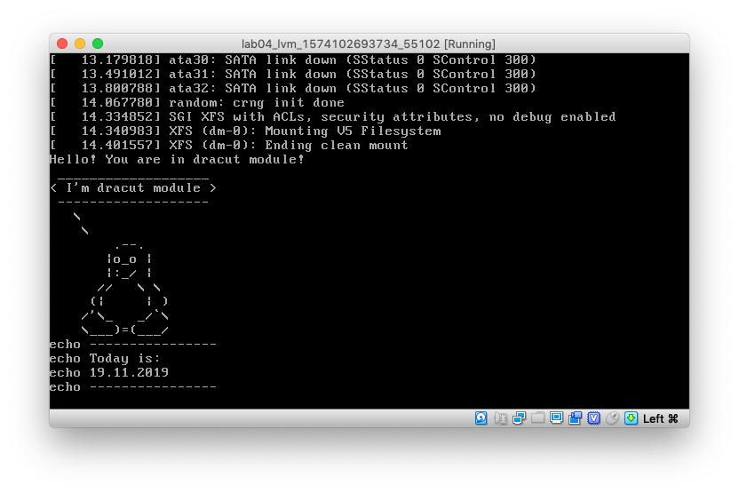

# Загрузка системы

## Сброс пароля

[Инструкция по сбросу пароля](password_recovery.md)

## Переименование LVM Volume Group

[Script](rename_root_lvm)

## Добавление модуля в initrd

[Script](dracut_module_test)

