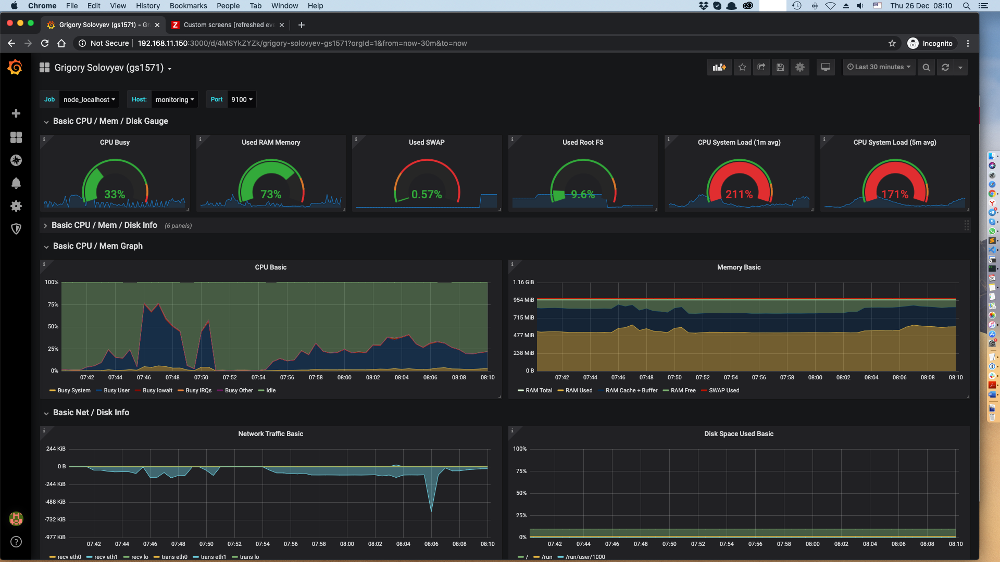
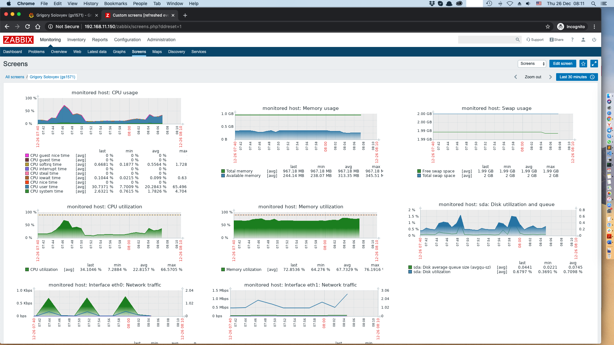

# Мониторинг и алертинг

## Домашнее задание

## Полезная информация

### Настройка Prometheus + Grafana
* https://eax.me/prometheus-and-grafana/
* https://grafana.com/docs/grafana/latest/installation/rpm/

### Настройка LAMP + Zabbix Server + Zabbix Agent
* https://www.digitalocean.com/community/tutorials/how-to-install-linux-apache-mysql-php-lamp-stack-on-centos-7
* https://www.digitalocean.com/community/tutorials/how-to-install-and-configure-zabbix-to-securely-monitor-remote-servers-on-centos-7
