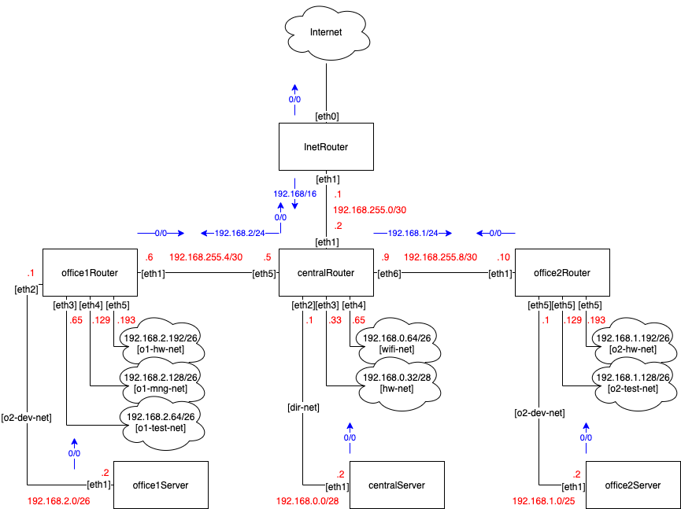

# Архитектура сетей

## Домашнее задание

### Диаграмма  



### Список сетей

#### Используемые сети

| Network          | Hosts | Broadcast      |
|------------------|-------|----------------|
| 192.168.255.0/30 | 2     | 192.168.255.3  |
| 192.168.255.4/30 | 2     | 192.168.255.7  |
| 192.168.255.8/30 | 2     | 192.168.255.11 |
| 192.168.0.0/28   | 14    | 192.168.0.15   |
| 192.168.0.32/28  | 14    | 192.168.0.47   |
| 192.168.0.64/26  | 62    | 192.168.0.127  |
| 192.168.1.0/25   | 126   | 192.168.1.127  |
| 192.168.1.128/26 | 62    | 192.168.1.191  |
| 192.168.1.192/26 | 62    | 192.168.1.255  |
| 192.168.2.0/26   | 62    | 192.168.2.63   |
| 192.168.2.64/26  | 62    | 192.168.2.127  |
| 192.168.2.128/26 | 62    | 192.168.2.191  |
| 192.168.2.192/26 | 62    | 192.168.2.255  |

#### Неиспользуемые сети из блока 192.168.0.0/24

192.168.0.16/28  
192.168.0.48/28  
192.168.0.128/25  	

#### Неиспользуемые сети из блока 192.168.1.0/24

Нет

#### Неиспользуемые сети из блока 192.168.2.0/24

Нет

#### Неиспользуемые сети из блока 192.168.255.0/24

192.168.255.12/30	  
192.168.255.16/28  
192.168.255.32/27  
192.168.255.64/26  
192.168.255.128/25  

### Стенд

Стенд разворачивается через [Vagrantfile](Vagrantfile) в котором при провижиненге последней VM запускается ansible-playbook, настройка VM происходит следующим образом:
1. Удаляются все default маршруты везде, кроме inetRouter. Там же создаются default маршруты для вызода в Интернет через inetRouter.
1. Для обратного трафика прописываются статические маршруты:
 * inetRouter: 192.168.0.0/16 через centralRouter;
 * centralRouter: 192.168.1.0/24 через office2Router;
 * centralRouter: 192.168.2.0/24 через office1Router.

 Для проверка запускаем traceroute до домашнего роутера - 100.100.0.1:

 ```
 ansible all -a "traceroute -n -w 1 100.100.0.1"
centralServer | CHANGED | rc=0 >>
traceroute to 100.100.0.1 (100.100.0.1), 30 hops max, 60 byte packets
 1  192.168.0.1  4.250 ms  3.887 ms  3.560 ms
 2  192.168.255.1  18.198 ms  18.019 ms  17.829 ms
 3  * * *
 4  * * *
 5  * * *
 6  100.100.0.1  21.257 ms * *

inetRouter | CHANGED | rc=0 >>
traceroute to 100.100.0.1 (100.100.0.1), 30 hops max, 60 byte packets
 1  10.0.2.2  5.980 ms  5.480 ms  5.005 ms
 2  * * *
 3  * * *
 4  * * 100.100.0.1  1.828 ms

office1Router | CHANGED | rc=0 >>
traceroute to 100.100.0.1 (100.100.0.1), 30 hops max, 60 byte packets
 1  192.168.255.5  5.110 ms  4.698 ms  4.314 ms
 2  192.168.255.1  3.974 ms  3.496 ms  3.269 ms
 3  * * *
 4  * * *
 5  * * *
 6  * * *
 7  * * *
 8  * 100.100.0.1  17.466 ms  17.033 ms

office2Router | CHANGED | rc=0 >>
traceroute to 100.100.0.1 (100.100.0.1), 30 hops max, 60 byte packets
 1  192.168.255.9  0.740 ms  0.485 ms  0.579 ms
 2  192.168.255.1  1.096 ms  1.368 ms  1.732 ms
 3  * * *
 4  * * *
 5  * * *
 6  * * *
 7  * * *
 8  * 100.100.0.1  13.052 ms  12.662 ms

centralRouter | CHANGED | rc=0 >>
traceroute to 100.100.0.1 (100.100.0.1), 30 hops max, 60 byte packets
 1  192.168.255.1  5.350 ms  4.963 ms  4.589 ms
 2  * * *
 3  * * *
 4  * * *
 5  * * *
 6  * * *
 7  * * *
 8  * * *
 9  * * 100.100.0.1  22.810 ms

office2Server | CHANGED | rc=0 >>
traceroute to 100.100.0.1 (100.100.0.1), 30 hops max, 60 byte packets
 1  192.168.1.1  5.383 ms  4.986 ms  4.650 ms
 2  192.168.255.9  4.448 ms  4.257 ms  3.927 ms
 3  192.168.255.1  7.558 ms  8.197 ms  7.874 ms
 4  * * *
 5  * * *
 6  * * *
 7  * * *
 8  * * *
 9  * 100.100.0.1  3.322 ms  8.423 ms

office1Server | CHANGED | rc=0 >>
traceroute to 100.100.0.1 (100.100.0.1), 30 hops max, 60 byte packets
 1  192.168.2.1  4.203 ms  3.813 ms  3.598 ms
 2  192.168.255.5  3.185 ms  5.291 ms  5.581 ms
 3  192.168.255.1  8.592 ms  9.098 ms  9.602 ms
 4  * * *
 5  * * *
 6  * * *
 7  * * *
 8  * * *
 9  * 100.100.0.1  5.910 ms  7.480 ms
 ```

## Полезная информация

http://stable.ascii-flow.appspot.com/  
https://www.tablesgenerator.com/markdown_tables  