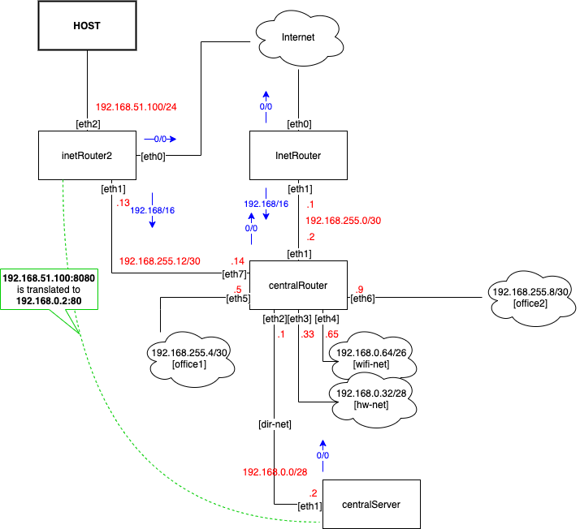

# Фильтрация трафика 

## Домашнее задание

### Диаграмма



### Стенд

Стенд разворачивается через [Vagrantfile](Vagrantfile) в котором при провижининге последней VM запускается ansible-playbook.

На машине inetRouter настраивается port knocking средствами iptables, но только для запросов с адреса 192.168.255.2 (central Router), что бы не ломать механизмы провижининга. Что бы подключиться по ssh с centralRouter на inetRouter требуется предварительно послать пакеты на TCP порты в следующем порядке: 32871 -> 32277 -> 27196. Для упрощения тестирования, на centralServer копируется скрипт [knock.sh](scripts/knock.sh).

```bash
[vagrant@centralRouter ~]$ ssh 192.168.255.1
^C
[vagrant@centralRouter ~]$ ./knock.sh 192.168.255.1 32871 32277 27196

Starting Nmap 6.40 ( http://nmap.org ) at 2020-02-19 06:09 UTC
Warning: 192.168.255.1 giving up on port because retransmission cap hit (0).
Nmap scan report for 192.168.255.1
Host is up.
PORT      STATE    SERVICE
32871/tcp filtered unknown

Nmap done: 1 IP address (1 host up) scanned in 1.05 seconds

Starting Nmap 6.40 ( http://nmap.org ) at 2020-02-19 06:09 UTC
Warning: 192.168.255.1 giving up on port because retransmission cap hit (0).
Nmap scan report for 192.168.255.1
Host is up.
PORT      STATE    SERVICE
32277/tcp filtered unknown

Nmap done: 1 IP address (1 host up) scanned in 1.05 seconds

Starting Nmap 6.40 ( http://nmap.org ) at 2020-02-19 06:09 UTC
Warning: 192.168.255.1 giving up on port because retransmission cap hit (0).
Nmap scan report for 192.168.255.1
Host is up.
PORT      STATE    SERVICE
27196/tcp filtered unknown

Nmap done: 1 IP address (1 host up) scanned in 1.05 seconds
[vagrant@centralRouter ~]$ ssh 192.168.255.1
vagrant@192.168.255.1's password:

[vagrant@centralRouter ~]$
```

На centralServer устанавливается nginx на порту 80, inetRouter2 настраивается для проброса локального порта 8080 на порт 80 centralServer средствами iptables. Для проверки между intetRouter2 и хостовой машиной поднята сеть 192.168.51.0/24, с хостовой машины надо послать запрос на 192.168.51.100:8080 и будет получен ответ от nginx поднятого на на centralServer.

## Полезная информация

Просмотр таблиц модуля recent:

```
cat /proc/net/xt_recent/<table name>
```
