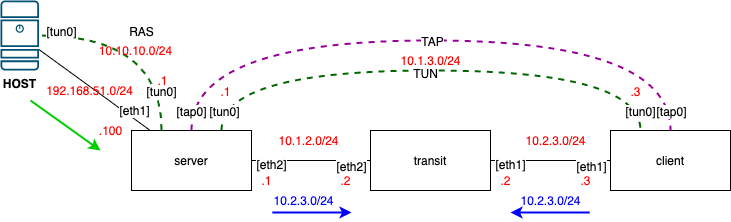

# Мосты, туннели и VPN 

## Домашнее задание

### Диаграмма



### Стенд

Стенд разворачивается через [Vagrantfile](Vagrantfile) в котором при провижининге последней VM запускается ansible-playbook.

В процессе исполнения playbook создается TUN tunnel между server и client и производится измерение скорости с помощью iperf. Затем создается TAP tunnel и так же производится его измерение. В итоге выводится результат.

Далее server настраивается как Remote Access Server. Для подключения к нему следует выполнить команду `sudo openvpn --config client.conf`. Проверка работоспособности выполняется командой `ping`.

```bash
[gsol@otus-lab lab23]$ sudo openvpn --config client.conf
Thu Feb 27 05:35:03 2020 OpenVPN 2.4.8 x86_64-redhat-linux-gnu [SSL (OpenSSL)] [LZO] [LZ4] [EPOLL] [PKCS11] [MH/PKTINFO] [AEAD] built on Nov  1 2019
Thu Feb 27 05:35:03 2020 library versions: OpenSSL 1.1.1c FIPS  28 May 2019, LZO 2.08
Thu Feb 27 05:35:03 2020 WARNING: No server certificate verification method has been enabled.  See http://openvpn.net/howto.html#mitm for more info.
Thu Feb 27 05:35:03 2020 TCP/UDP: Preserving recently used remote address: [AF_INET]192.168.51.100:1207
Thu Feb 27 05:35:03 2020 Socket Buffers: R=[212992->212992] S=[212992->212992]
Thu Feb 27 05:35:03 2020 UDP link local (bound): [AF_INET][undef]:1194
Thu Feb 27 05:35:03 2020 UDP link remote: [AF_INET]192.168.51.100:1207
Thu Feb 27 05:35:03 2020 TLS: Initial packet from [AF_INET]192.168.51.100:1207, sid=68f17355 e1241f03
Thu Feb 27 05:35:03 2020 VERIFY OK: depth=1, CN=rasvpn
Thu Feb 27 05:35:03 2020 VERIFY OK: depth=0, CN=rasvpn
Thu Feb 27 05:35:03 2020 Control Channel: TLSv1.2, cipher TLSv1.2 ECDHE-RSA-AES256-GCM-SHA384, 2048 bit RSA
Thu Feb 27 05:35:03 2020 [rasvpn] Peer Connection Initiated with [AF_INET]192.168.51.100:1207
Thu Feb 27 05:35:04 2020 SENT CONTROL [rasvpn]: 'PUSH_REQUEST' (status=1)
Thu Feb 27 05:35:04 2020 PUSH: Received control message: 'PUSH_REPLY,route 10.10.10.0 255.255.255.0,topology net30,ping 10,ping-restart 120,ifconfig 10.10.10.6 10.10.10.5,peer-id 0,cipher AES-256-GCM'
Thu Feb 27 05:35:04 2020 OPTIONS IMPORT: timers and/or timeouts modified
Thu Feb 27 05:35:04 2020 OPTIONS IMPORT: --ifconfig/up options modified
Thu Feb 27 05:35:04 2020 OPTIONS IMPORT: route options modified
Thu Feb 27 05:35:04 2020 OPTIONS IMPORT: peer-id set
Thu Feb 27 05:35:04 2020 OPTIONS IMPORT: adjusting link_mtu to 1625
Thu Feb 27 05:35:04 2020 OPTIONS IMPORT: data channel crypto options modified
Thu Feb 27 05:35:04 2020 Data Channel: using negotiated cipher 'AES-256-GCM'
Thu Feb 27 05:35:04 2020 Outgoing Data Channel: Cipher 'AES-256-GCM' initialized with 256 bit key
Thu Feb 27 05:35:04 2020 Incoming Data Channel: Cipher 'AES-256-GCM' initialized with 256 bit key
Thu Feb 27 05:35:04 2020 ROUTE_GATEWAY 100.100.0.1/255.255.252.0 IFACE=ens192 HWADDR=00:0c:29:b7:bb:bc
Thu Feb 27 05:35:04 2020 TUN/TAP device tun0 opened
Thu Feb 27 05:35:04 2020 TUN/TAP TX queue length set to 100
Thu Feb 27 05:35:04 2020 /sbin/ip link set dev tun0 up mtu 1500
Thu Feb 27 05:35:04 2020 /sbin/ip addr add dev tun0 local 10.10.10.6 peer 10.10.10.5
Thu Feb 27 05:35:04 2020 /sbin/ip route add 10.10.10.0/24 via 10.10.10.5
Thu Feb 27 05:35:04 2020 WARNING: this configuration may cache passwords in memory -- use the auth-nocache option to prevent this
Thu Feb 27 05:35:04 2020 Initialization Sequence Completed

[gsol@otus-lab lab23]$ ip r
default via 100.100.0.1 dev ens192 proto static metric 100
10.10.10.0/24 via 10.10.10.5 dev tun0
10.10.10.5 dev tun0 proto kernel scope link src 10.10.10.6
100.100.0.0/22 dev ens192 proto kernel scope link src 100.100.0.200 metric 100
100.100.0.0/22 dev ens192 proto kernel scope link src 100.100.3.39 metric 100
192.168.51.0/24 dev vboxnet0 proto kernel scope link src 192.168.51.1
192.168.122.0/24 dev virbr0 proto kernel scope link src 192.168.122.1 linkdown
[gsol@otus-lab lab23]$ ping 10.10.10.1
PING 10.10.10.1 (10.10.10.1) 56(84) bytes of data.
64 bytes from 10.10.10.1: icmp_seq=1 ttl=64 time=0.746 ms
64 bytes from 10.10.10.1: icmp_seq=2 ttl=64 time=0.782 ms
64 bytes from 10.10.10.1: icmp_seq=3 ttl=64 time=1.57 ms
^C
--- 10.10.10.1 ping statistics ---
3 packets transmitted, 3 received, 0% packet loss, time 43ms
rtt min/avg/max/mdev = 0.746/1.033/1.571/0.380 ms
```

## Полезная информация


