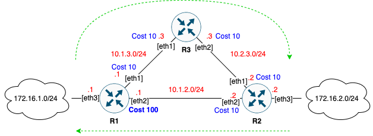
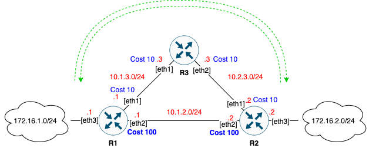

# Статическая и динамическая маршрутизация

## Домашнее задание

### Диаграмма ассиметричного роутинга

### Диаграмма симметричного  роутинга

### Стенд

Стенд разворачивается через [Vagrantfile](Vagrantfile) в котором при провижиненге последней VM запускается ansible-playbook.

На всех трех машинах запускается BIRD и настраивается OSPF. На роутерах r1 и r2 есть подключенные только к ним сети, которые используются для проверки.

В процессе запуска playbook сначала настраивается схема ассиметричного роутинга и демонстируется результат выводом команды traceroute. Затем конфигурируется схема симметричного роутинга и так же демонстрируется.

## Полезная информация

