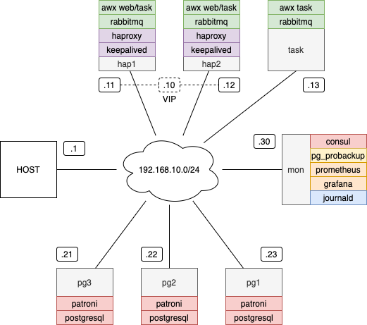
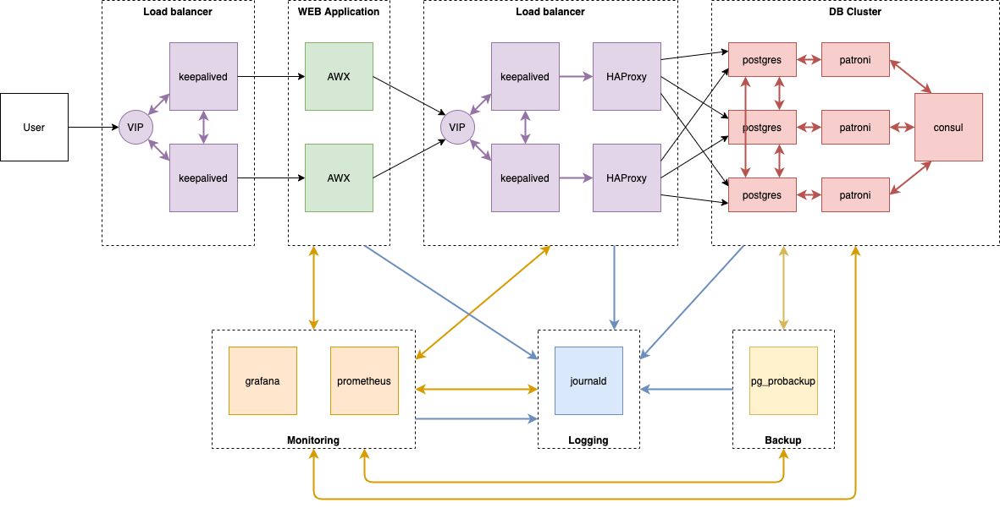

# High-Avalability Atomation platform based on AWX

## Description

The project presents very common architecture of infrastructure for a WEB application. 
The lab eviroment has:
* Load balancers
  - keepalived
  - haproxy
* WEB application
  - AWX version 9.2.0
* Database cluster
  - PostgreSQL Patroni cluster with three nodes
* Backup of the database
  - pg_probackup
* Loging server
  - journald
* Monitoring server
  - grafana
  - prometheus

All of them will be connected to one network and spread over seven VMs follow the diagram:



Functional diagram is presented below:



Some specific points of the lab enviroments:
- traffic to AWX web nodes balanced by VRRP since they can work in same time for management of AWX
- at least of three task nodes is required for AWX cluster, since additional VM just for wax task purpose is intriduced

Thanks a lot for Ansible roles of AWX cluster to [sujiar37](https://github.com/sujiar37). I adopted material from his repo https://github.com/sujiar37/AWX-HA-InstanceGroup.

Thanks a lot for webjournal app for journald-remote to [skob](https://github.com/skob). I adopted material from his repo https://github.com/skob/journal.

### Checklist

* [x] Common config
* [x] Keepalived pair
* [x] HAProxy pair
* [x] Patroni cluster
* [x] AWX cluster
* [-] Intermediate testing
  - [x] shutdown hap1
  - [x] no shutdown hap1
  - [-] shutdown hap2
  - [-] no shutdown hap2
  - [-] shutdown task
  - [-] no shutdown task
  - [-] shutdown pg1
  - [-] no shutdown pg1
  - [x] shutdown pg2
  - [x] no shutdown pg2
  - [-] shutdown pg3
  - [-] no shutdown pg3
* [-] Postgres backup
  - [-] databse
  - [-] WAL
* [-] Firewall
* [+] Logging
  - [+] haproxy
  - [+] patroni
  - [-] consul
  - [-] postgres
  - [-] awx
  - [-] pg_probackup
* [-] Prometheus
* [-] Grafana
* [-] Final testing
  - [-] shutdown hap1
  - [-] no shutdown hap1
  - [-] shutdown hap2
  - [-] no shutdown hap2
  - [-] shutdown task
  - [-] no shutdown task
  - [-] shutdown pg1
  - [-] no shutdown pg1
  - [-] shutdown pg2
  - [-] no shutdown pg2
  - [-] shutdown pg3
  - [-] no shutdown pg3

Optional:
* [-] IPv6

## Useful links and notes

### Resources of the lab

* HAPoxy
  - url: [http://192.168.10.10:7000]

* AWX
  - url: [http://192.168.10.10]
  - user: admin
  - password: password

* PostgreSQL
  - url: psql://192.168.10.10:5000
  - user: postgres
  - password: gfhjkm

* webjournal
  - url: [http://192.168.10.30]
  
* Consul
  - url: [http://192.168.10.30:8500]

### How to check

Patroni
```
/usr/local/bin/patronictl -c /etc/patroni/patroni.yml list

psql -U postgres -h 192.168.10.10 -p 5000

postgres=# select * from pg_stat_replication;

SELECT d.datname as "Name",
pg_catalog.pg_get_userbyid(d.datdba) as "Owner"
FROM pg_catalog.pg_database d
WHERE d.datname = 'your_name'
ORDER BY 1;
```

journald
```
journalctl -D /var/log/journal/remote/ --follow
```

### Otus projects

* https://otus.ru/nest/post/801/

* https://otus.ru/nest/post/384/

* 
https://otus.ru/nest/post/638/
* https://github.com/sinist3rr/otus-linux/tree/master/PROJ

### HAProxy
* https://dasunhegoda.com/how-to-setup-haproxy-with-keepalived/833/

### AWX

Base version:
* https://github.com/ansible/awx/blob/devel/INSTALL.md - official installation guide
* https://www.centlinux.com/2019/09/install-ansible-use-playbooks-centos-7.html
* https://www.centlinux.com/2019/09/install-ansible-awx-with-docker-compose-on-centos-7.html

HA version:
* https://github.com/sujiar37/AWX-HA-InstanceGroup - AWX on docker with HA

### Journald

* https://habr.com/ru/company/southbridge/blog/317182/
* https://sematext.com/docs/logagent/how-to-centralize-linux-system-journal/

### Working notes (will be removed)

pre-install
```
yum-config-manager --add-repo=https://download.docker.com/linux/centos/docker-ce.repo
yum install -y ansible git gcc gcc-c++ nodejs gettext device-mapper-persistent-data lvm2 bzip2 python-pip python-devel docker-ce
pip install --upgrade pip
pip install docker-compose
systemctl enable --now docker
```

inventory file
```
pg_hostname=192.168.10.10
pg_port=5000
```

database
```
psql -U postgres -h hap -p 5000
CREATE USER awx WITH ENCRYPTED PASSWORD 'awxpass';
CREATE DATABASE awx OWNER awx;
```

install
```
git clone --depth 50 https://github.com/ansible/awx.git
cd awx/installer
ansible-playbook -i inventory install.yml
```

cli
```
pip install "https://github.com/ansible/awx/archive/11.0.0.tar.gz#egg=awxkit&subdirectory=awxkit" --install-option="--install-scripts=/usr/bin"
```


```
sudo yum install -y ansible git
```
HA-AWX
```
git clone https://github.com/sujiar37/AWX-HA-InstanceGroup.git
cd AWX-HA-InstanceGroup/
ansible-playbook -i inventory/hosts awx_ha.yml --skip-tags fw_rules -vvvv
```
```
cat > inventory/hosts
[all]

[awx_instance_group_web]
hap1
hap2

[awx_instance_group_task]
task1

```
```
cat > inventory/group_vars/all.yml
---
ansible_user: vagrant
ansible_password: vagrant
### AWX Default Settings
awx_unique_secret_key: awxsecret
awx_admin_default_pass: password

### Postgre DB details
pg_db_host: "192.168.10.10"
pg_db_pass: "awxpass"
pg_db_port: "5000"
pg_db_user: "awx"
pg_db_name: "awx"


###  RabbitMQ default settings
rabbitmq_cookie: "cookiemonster"
rabbitmq_username: "awx"
rabbitmq_password: "password"
```
Re run docker containers
```
cd /var/lib/awx/build_image && docker-compose restart
```

### Postgres Backup

* https://postgrespro.ru/education/courses/DBA1 - PostgreSQL backup lecture 17
* https://postgrespro.github.io/pg_probackup/ - documenation
* https://github.com/postgrespro/pg_probackup - installation
* https://postgrespro.ru/docs/postgrespro/10/app-pgprobackup - useful documentation

Advises:
* full backup
```
pg_probackup-11 backup \
        -d postgres \
        -B $BACKUP_FOLDER \
        --instance $BACKUP_INSTANCE \
        --compress-algorithm=zlib \
        --compress-level=4 \
        -j 4 \
        --log-filename=$BACKUP_LOG_FILENAME \
        --log-level-console=info \
        --log-level-file=info \
        --remote-user=$BACKUP_REMOTE_USER \
        --remote-host=$BACKUP_HOST \
        -b FULL
}
```
* Purge old backups
```
# Purge old backup
function backup_delete {
pg_probackup-11 delete \
        -B $BACKUP_FOLDER \
        --instance $BACKUP_INSTANCE \
        --retention-redundancy=30 \
        --wal-depth=30 \
        --delete-wal \
        --delete-expired \
        --merge-expired \
}
```
* Restoration
```
bootstrap:
  method: probackup
  probackup:
    command: ssh dbbackup@<backup_IP> 'bash /var/backup/pg_restore.sh'
    keep_existing_recovery_conf: false
    recovery_conf:
     recovery_target_timeline: latest
     restore_command: pg_probackup-11 archive-get -B /var/backup --instance db-mt --remote-user=dbbackup --wal-file-path %p --wal-file-name %f --remote-host=<remote_host_ip>
```
> Это на бекап хосте. И он по ссх коннектится к хосту БД. Там тоже нужен pg_probackup
